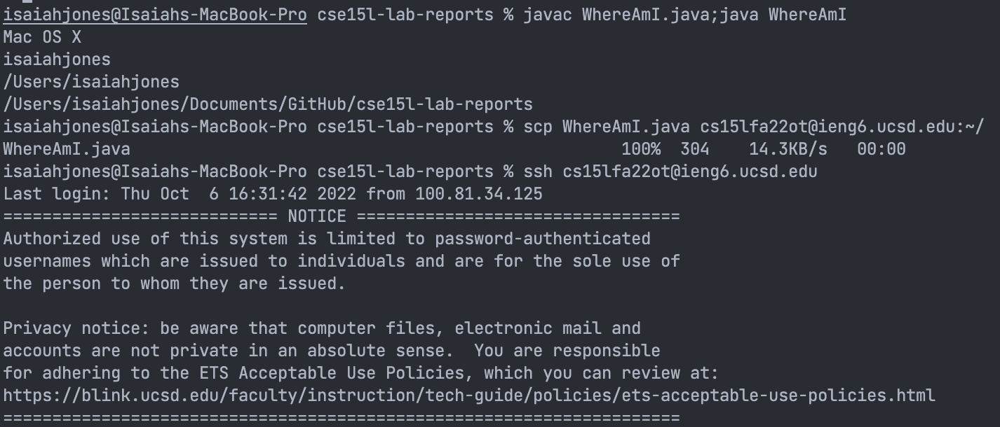
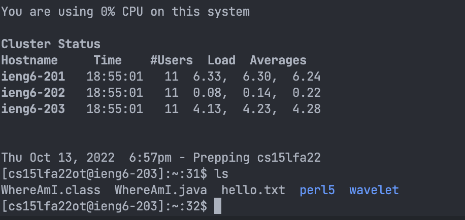
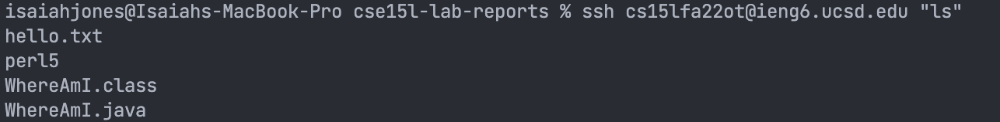

**Part 1: Installing VScode**
* Visit [VScode Website](https://code.visualstudio.com/download)
* Download for Windows or Mac depending on your system.

**Part 2: Remotely Connecting**
* Note: If you are on Windows install [OpenSSH](https://learn.microsoft.com/en-us/windows-server/administration/openssh/openssh_install_firstuse?tabs=gui)
* To find your account go to [link](https://sdacs.ucsd.edu/~icc/index.php) and enter your username and PID.
* Once installed, open VScode and open the Terminal (Ctrl or Command + `)
* In the terminal, type

<pre><code>ssh cs15lfa22zz@ieng6.ucsd.edu
Note: replace zz with your specific account letters </code></pre>

* Enter your password. If you would like to reset your passowrd then visit [this link](https://docs.google.com/document/d/1hs7CyQeh-MdUfM9uv99i8tqfneos6Y8bDU0uhn1wqho/edit)
* You will then be prompted by a message. In the terminal type **yes**.
* If done correctly, it should look like this:

* You are now connected remotely!

**Part 3: Trying Some Commands**
* Once you are in the server, try running some commands. Some useful commads are <code>ls pwd mkdir cat cp</code>
* <code>ls</code> or "list" is used to list the files and folders in the current directory. <code>pwd</code> or "print working directory" is used to diplsay the current directoy. <code>cat</code> or "concatenate" is used to print the conents in one or more files. <code>cp</code> or "copy" is used to copy files or directories.

**Part 4: Moving Files With scp**
* You can copy files using <code>scp</code> also known as secure copy.
* In your terminal, type 
<pre><code>scp File Name cs15lfa22zz@ieng6.ucsd.edu:~/
Note: Replace zz with you specific letters 
</code></pre>
* Enter your password once prompted. 

* To check if your file is in the server, log into your remote account and use <code>ls</code>
* If the file is shown in the output, use <code>cat</code> followed by the file name in the terminal. The contents of the file should be shown.
* You have successfully copied the file 

**Part 5: Setting an SSH key**
* In the terminal type <code>ssh-keygen</code>
* You will then be prompted to enter a file which the key will be saved in, which is <code>/Users/isaiahjones/.ssh/id_rsa</code> 
* It will then prompt you to enter a passphrase. You can either enter something or leave it blank by pressing enter. 
* Now you should copy the public key to ssh directory. 
* **On the client,** sign into your server account. 
* In the terminal enter <code>mkdir .ssh</code>. Then logout using <code>exit</code>
* You should know be able to sign into the server without using a password.

* If done correctly, then you should not be prompted for a password when logging in remotely

**Part 6: Optimizing Remote Running**
* There are many ways to optimize remote running.
* In VScode, you can Command + o or in windows Ctrl + o to open a new file. Once the file opens, you can edit it and then Commnad + s or Ctrl + s in Windows to save the file. 
* A shortcut to open the terminal is Ctrl + `.
* In the terminal you can use <pre><code>ssh cs15lfa22@ieng6.ucsd.edu "ls"</code></pre> to sign and view the list of files. Using quotes at the end to directly run once logged in. 
* Once you find your new file you can use <pre><code>cp FileName.java; javac FileName.java; java FileName</code></pre>
You can use semicolons to run mutiple commands
* Lastly, you can use the up arrow key to go to the previously typed command. 

