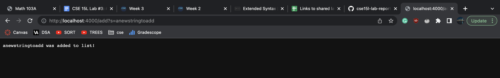

**Part 1**
```
import java.io.IOException;
import java.net.URI;
import java.util.ArrayList;

class Handler implements URLHandler {
    // The one bit of state on the server: a number that will be manipulated by
    // various requests.
    String string = "";
    ArrayList<String> string2 = new ArrayList<>();
    ArrayList<String> searchResults = new ArrayList<>();
    
    public String handleRequest(URI url) {
        if (url.getPath().equals("/")) {
            return String.format("String: %s", string2.toString());
        } else {
            System.out.println("Path: " + url.getPath());
            if (url.getPath().contains("/add")) {
                String[] parameters = url.getQuery().split("=");
                if (parameters[0].equals("s")) {
                    string2.add(parameters[1]);
                    return String.format("%s was added to list!", parameters[1]);
                } 
            }
            else {
                String[] parameters2 = url.getQuery().split("=");
                for (int i = 0; i < string2.size(); i++){
                    if (string2.get(i).contains(parameters2[1])){
                        searchResults.add(string2.get(i));
                    }
                }
                return String.format("String: %s", searchResults.toString());
            }
            return "404 Not Found!";
        }
    }
}

class NumberServer {
    public static void main(String[] args) throws IOException {
        if(args.length == 0){
            System.out.println("Missing port number! Try any number between 1024 to 49151");
            return;
        }

        int port = Integer.parseInt(args[0]);

        Server.start(port, new Handler());
    }
}
```


*
*



*
*


*
*


*
*


*
*


**Part 2**

Bug 1: Reveresed

* Failure Inducing Input
```
@Test
  public void testReversed2() {
    int[] input1 = {1, 2, 3};
    System.out.println(ArrayExamples.reversed(input1));
    assertArrayEquals(new int[]{3, 2, 1}, ArrayExamples.reversed(input1));
  }
 ```
* The Symptom
```
2) testReversed2(ArrayTests)
arrays first differed at element [0]; expected:<3> but was:<0>
        at org.junit.internal.ComparisonCriteria.arrayEquals(ComparisonCriteria.java:78)
        at org.junit.internal.ComparisonCriteria.arrayEquals(ComparisonCriteria.java:28)
        at org.junit.Assert.internalArrayEquals(Assert.java:534)
        at org.junit.Assert.assertArrayEquals(Assert.java:418)
        at org.junit.Assert.assertArrayEquals(Assert.java:429)
        at ArrayTests.testReversed2(ArrayTests.java:26)
        ... 30 trimmed
Caused by: java.lang.AssertionError: expected:<3> but was:<0>
        at org.junit.Assert.fail(Assert.java:89)
        at org.junit.Assert.failNotEquals(Assert.java:835)
        at org.junit.Assert.assertEquals(Assert.java:120)
        at org.junit.Assert.assertEquals(Assert.java:146)
        at org.junit.internal.ExactComparisonCriteria.assertElementsEqual(ExactComparisonCriteria.java:8)
        at org.junit.internal.ComparisonCriteria.arrayEquals(ComparisonCriteria.java:76)
        ... 36 more
```

* The Bug
```
static int[] reversed(int[] arr) {
    int[] newArray = new int[arr.length]; // arr.length = 3 -> [0, 0, 0] newArray
    for(int i = 0; i < arr.length; i += 1) {
      arr[i] = newArray[arr.length - i - 1] =; -> Bug Here
    }
    return arr; -> Bug Here
  }
```
*  There are two bugs that are causing the test to fail. The first bug is <code> arr[i] = newArray[arr.length - i - 1] </code>. Based on the code above. newArray is creating a list of length 3 filled with zeros ([0, 0, 0]). So, if we use <code> arr[i] = newArray[arr.length - i - 1] </code> then arr a list of length 3 filled with zeros. What this is doing is setting the value at newArray[arr.length - i - 1] to arr[i] when it should be setting the value at arr[i] to newArray[arr.length - i - 1]. The second bug is <code> return arr </code>. Since the method is supposed to create a new list then we she be returning newArray instead of arr. With these changes it should fix the reversed method. 


Bug 2: Filter

* Failure Inducing Input
```
@Test 
public void testFilter() {
    List<String> input1 = new ArrayList<>();
    input1.add("anewstringtoadd");
    input1.add("apple");
    input1.add("pineapple");

    List<String> actual = new ArrayList<>();
    actual.add("apple");
    actual.add("pineapple");
    
    StringChecker sc = new ListExamples();
    assertEquals(actual, ListExamples.filter(input1, sc));
	}
}
```
* The Symptom
```
2) testFilter(ArrayTests)
java.lang.AssertionError: expected:<[apple, pineapple]> but was:<[]>
        at org.junit.Assert.fail(Assert.java:89)
        at org.junit.Assert.failNotEquals(Assert.java:835)
        at org.junit.Assert.assertEquals(Assert.java:120)
        at org.junit.Assert.assertEquals(Assert.java:146)
        at ArrayTests.testFilter(ArrayTests.java:56)

```
* The Bug
```
class ListExamples{ -> Was a bug because we did not implement the interface, thus we could not use StringChecker. 

  // Returns a new list that has all the elements of the input list for which
  // the StringChecker returns true, and not the elements that return false, in
  // the same order they appeared in the input list;
  static List<String> filter(List<String> list, StringChecker sc) {
    List<String> result = new ArrayList<>();
    for(String s: list) {
      if(sc.checkString(s)) {
        result.add(0, s);
      }
    }
    return result;
  }
  
  @Override
  public boolean checkString(String s) { -> Was a bug. Only returned false, thus the List would always be empty.
    // TODO Auto-generated method stub
      return false; 
    }
  }
```
* After I fixed the implement bug and ran the test, the symptom returned that the list that is being returned is empty ([]). This relates to the checkString bug because it always returns false. Since it returns false on each iteration then it would not add anything the newly created list. Thus returning an empty list. This is why the test failed. 
