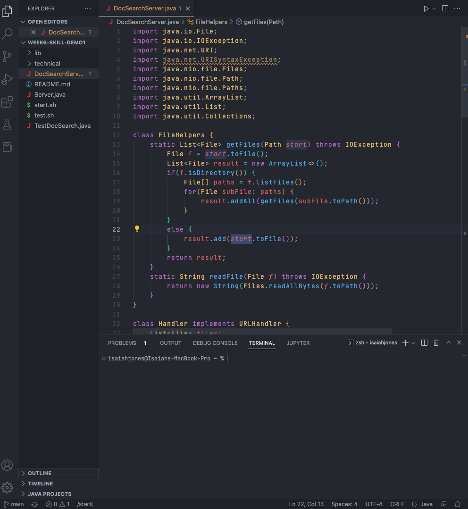
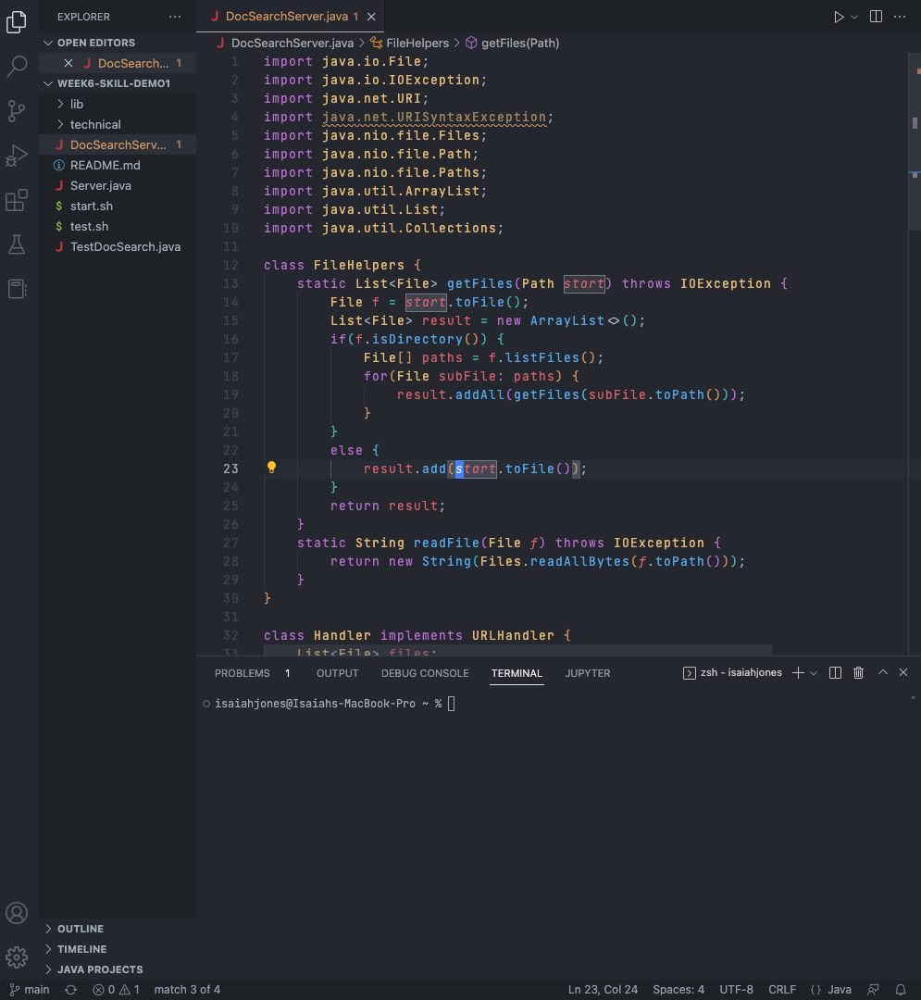
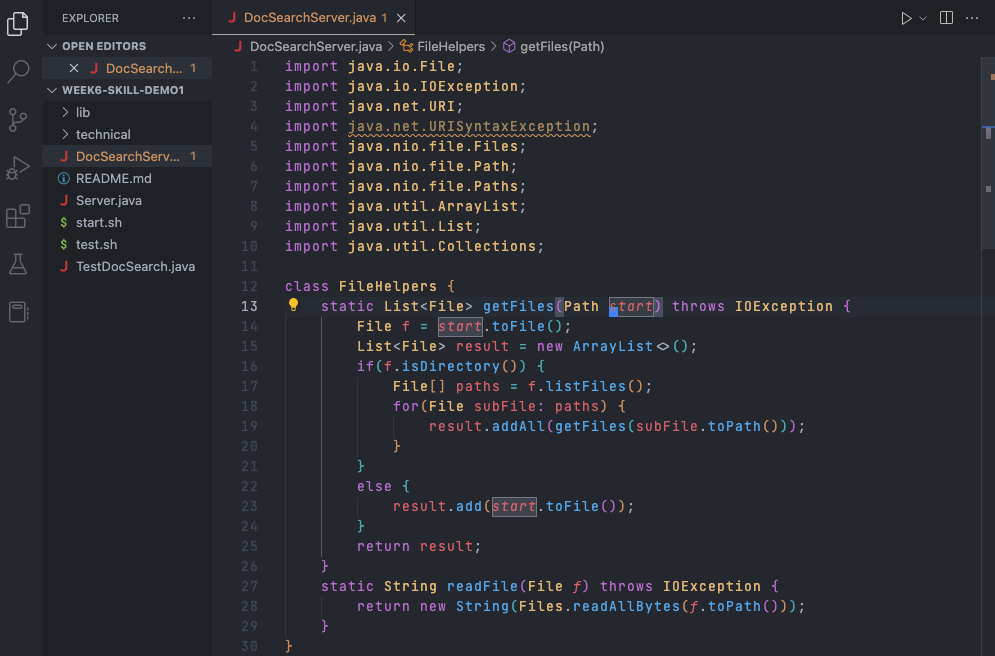
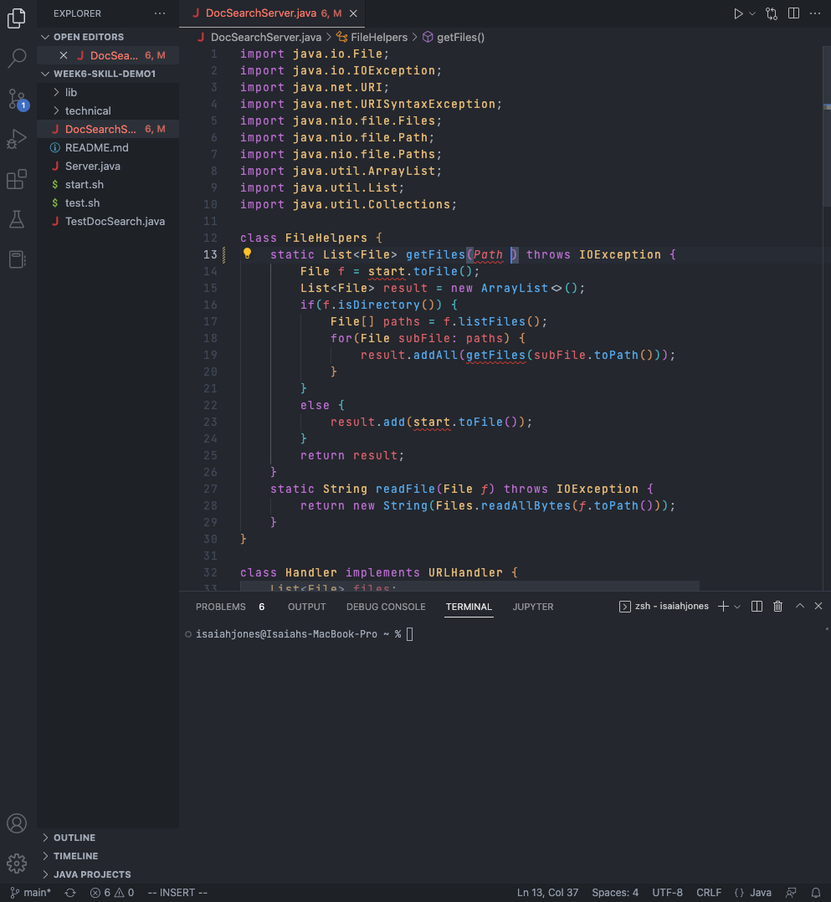
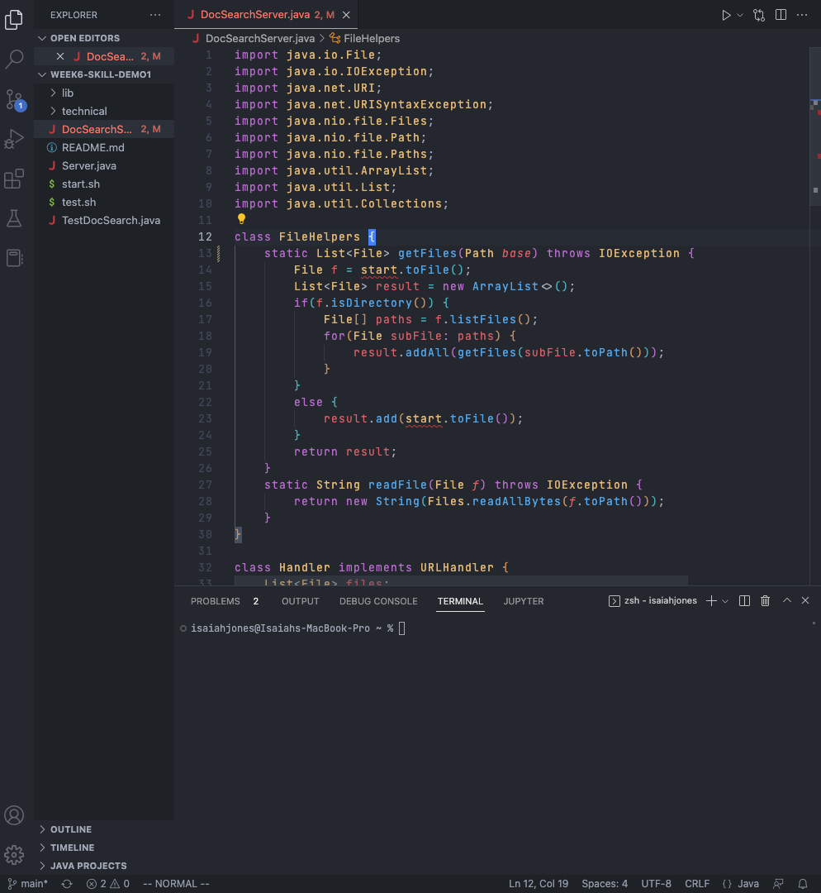
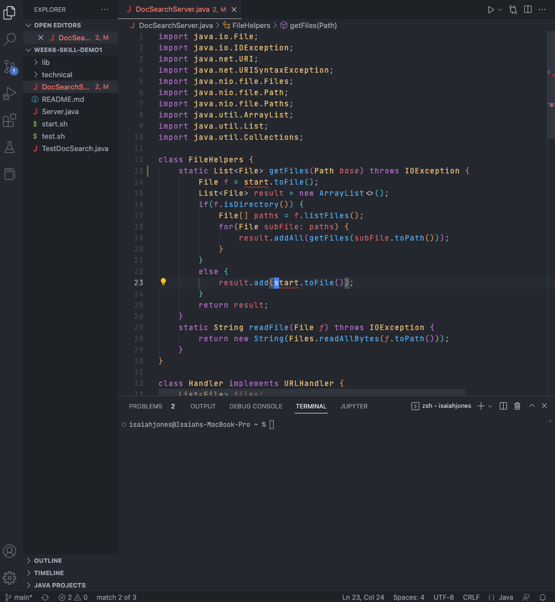
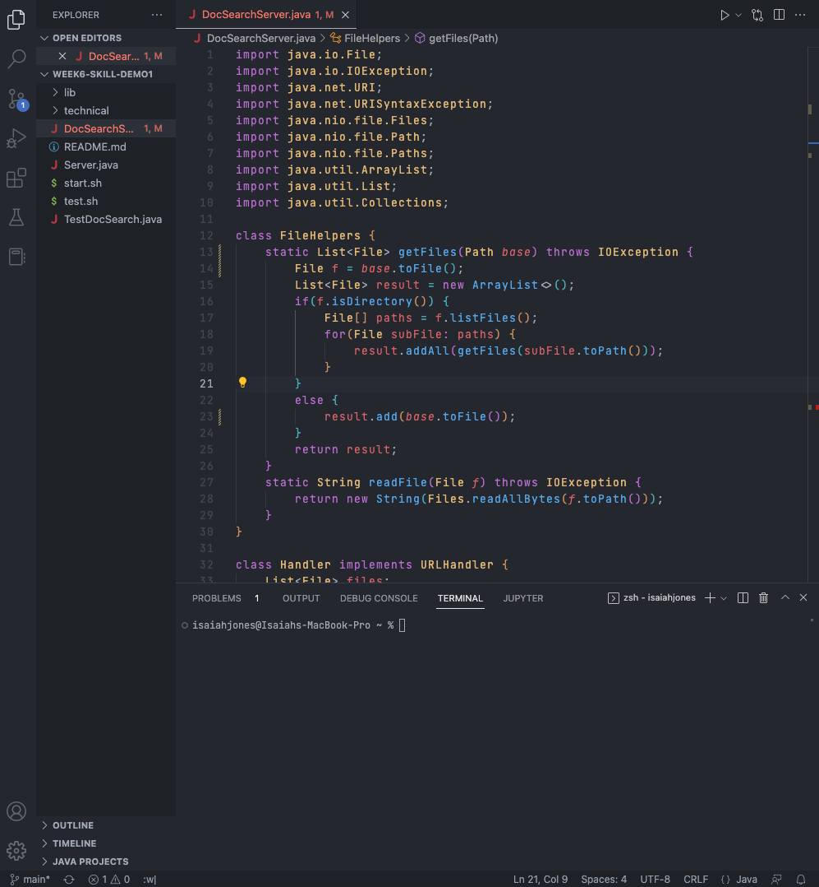

### Part 1: Change "start" to "base"


```
/start<Enter>ce base<Escape>n ce base<Escape>n ce base<Escape>n ce base<Escape> :w<Enter> 
```
#### /start(Enter)
  

  
 * /start (/pattern) searches for the parttern given. In this example, the pattern was start. So it looks for something in the code that matches start. In the screenshot above, you can see that if the pattern was matched it is highlighted. 
  
 
  
 * Once I pressed enter, it took me to the pattern that matched. I am unsure why it did not take me to the first occurence of the pattern, but to the second one. 
 *      
  
#### ce


* ce changes (replace/remove) the given word/pattern and enters insert mode. As you can see on the screenshot above, it finds the pattern then puts a blue highlight on it. 
  

* This screenshot is showcasing the removal of the word after I typed ce. 

#### base(Escape)

* I typed the pattern/word base per the instructions. As you can see in the screenshot above, once I pressed the escape key, it took me back into normal mode. In normal mode, you are not allowed to type. 

#### n 

* Instead of wasting time, typing /start, I use n in normal mode to repeat the search in the same direction. The rest of the sequence follows as normal. 

#### :w or :wq

* Once I have changed "start" to "base", I use :w to save the file. If you want to save the file and exit use :wq.

### Part 2
* Since I am more comfortable working locally than on a remote, I would prefer using option 1. However, once I get more comfortabe with working remotely than my answer may change. Also, since I am only copying 1 file, then it is usually fast. However, if I would have to copy multiple files then I can see the case for option 2 being better. 

* Copying over mutiple files to the remote server and being comfortable in the workspace are the biggest factors. If you had to copy mutiple files into the remote the it could take longer to complete the same task as if you were just working in the remote directly. As I stated previously, since I am more comfortable with working locally than remotely then I would probably choose the first option.
