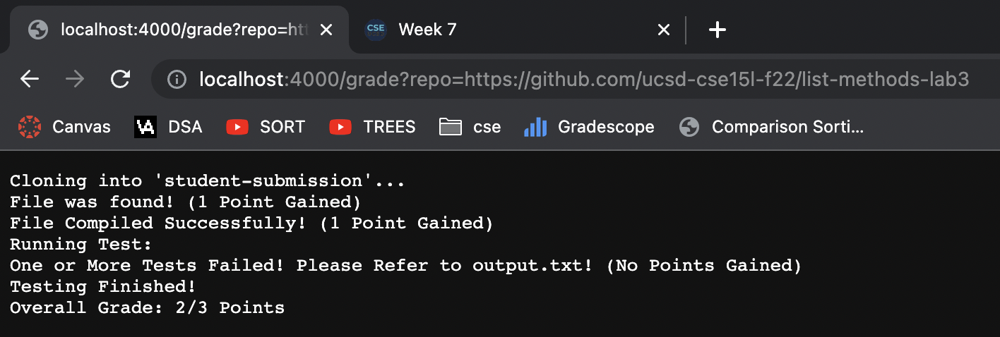

## Script for Autograder
```
# Create your grading script here
set -e
rm -rf student-submission
git clone $1 student-submission

cp TestListExamples.java student-submission
cp -R lib student-submission
cd student-submission
grade=0

if [ -f ListExamples.java ]
then 
    echo "File was found! (1 Point Gained)"
    ((grade+=1))
else
    echo "File not found! (No Points Gained)"
    exit 1
fi

set +e
javac -cp .:lib/hamcrest-core-1.3.jar:lib/junit-4.13.2.jar *.java 2> error.txt

if [ $? -ne 0 ]
then
    echo "Compile Error! Fix Error Below and Retry! (No Points Gained)"
    cat error.txt
    exit 1
else
    echo "File Compiled Successfully! (1 Point Gained)"
    ((grade+=1))
fi

echo "Running Test:"
java -cp .:lib/hamcrest-core-1.3.jar:lib/junit-4.13.2.jar org.junit.runner.JUnitCore TestListExamples > output.txt

if grep -q "fail" output.txt 
then
    echo "One or More Tests Failed! Please Refer to output.txt! (No Points Gained)"
else
    echo "All Test Passed! (1 Point Gained)"
    ((grade+=1))
fi

echo "Testing Finished!"

echo "Overall Grade: $grade/3 Points"

exit
```
#### Test Submission 1


#### Test Submission 2


#### Test Submission 3


## Test Submission 1 Trace
```
set -e
rm -rf student-submission
git clone $1 student-submission
```
* This block of code will exit the code if a command returns a non-zero status then remove the previous student-submission then clone the students directory. The standard output would be (Cloning into 'student-submission') and its return code would be 0 because in test submission 1, the previous directory was removed and students directory was cloned successfully.
```
cp TestListExamples.java student-submission
cp -R lib student-submission
cd student-submission
grade=0
```
* This block of code will copy the java file into student-submission, recusrivleey copy lib into student-submission, change into the student-submission directory, and create a variable to hold the grade in. The return code would be 0 because the commands ran successfully. No standard output. 
```
if [ -f ListExamples.java ]
then 
    echo "File was found! (1 Point Gained)"
    ((grade+=1))
else
    echo "File not found! (No Points Gained)"
    exit 1
fi
```
* This block of code will check if the java file is in student-submission. In test submission 1, the condition was true because the java file was found in student-submission thus, the standard outut is "File was found! (1 Point Gained)" and the return code is 0. The lines after ```else``` do not run because the file was found in student-submission. If the file wasn't found then the condition would be false and return the message "File not found! (No Points Gained)" and immediately exit. 

```
set +e
javac -cp .:lib/hamcrest-core-1.3.jar:lib/junit-4.13.2.jar *.java 2> error.txt

if [ $? -ne 0 ]
then
    echo "Compile Error! Fix Error Below and Retry! (No Points Gained)"
    cat error.txt
    exit 1
else
    echo "File Compiled Successfully! (1 Point Gained)"
    ((grade+=1))
fi
```
* This block of code turns off set -e (we do not want to exit if command returns non-zero status because we want the user to know the error given), compile the files in the directory, and then it will check if the java file compiled properly. In test submission 1, the condition was false because the java file did compile properly and ```$? = 0```, thus the standard ouptut is "File Compiled Successfully! (1 Point Gained)" and has a return code of 0. If the file did not compile properly then ```$? != 0``` and the condition would be true and echo "Compile Error! Fix Error Below and Retry! (No Points Gained)", ```cat error.txt```, and immediately exit. 
```
echo "Running Test:"
```
* This code echos a message. The standard output is "Running Test:" and has a return code of 0.
```
java -cp .:lib/hamcrest-core-1.3.jar:lib/junit-4.13.2.jar org.junit.runner.JUnitCore TestListExamples > output.txt

if grep -q "fail" output.txt 
then
    echo "One or More Tests Failed! Please Refer to output.txt! (No Points Gained)"
else
    echo "All Test Passed! (1 Point Gained)"
    ((grade+=1))
fi
```
* This block of code will test the TestListExamples class to check if the students code is correct and then it will check if all the test passed or failed. In test submission 1, the condition was true because a match was found. The standadrd output is "One or More Tests Failed! Please Refer to output.txt! (No Points Gained)" and has a retrn code of 0 (this is because grep will have a zero status if a match is found). In this test, there is no standard error, however, if there was an error then the standard error would print afer the standard output. If the file did not find the pattern in the file then the condtion would be false and it would echo "All Test Passed! (1 Point Gained)" and have a return code of ```!= 0```.
```
echo "Testing Finished!"
```
* This code echos a message. The standard output is "Testing Finished!" and has a return code of 0.
```
echo "Overall Grade: $grade/3 Points"
```
* This code echos a message. The standard output is "Overall Grade: 2/3 Points" and has a return code of 0.
```
exit
```
* This code exits the script.
